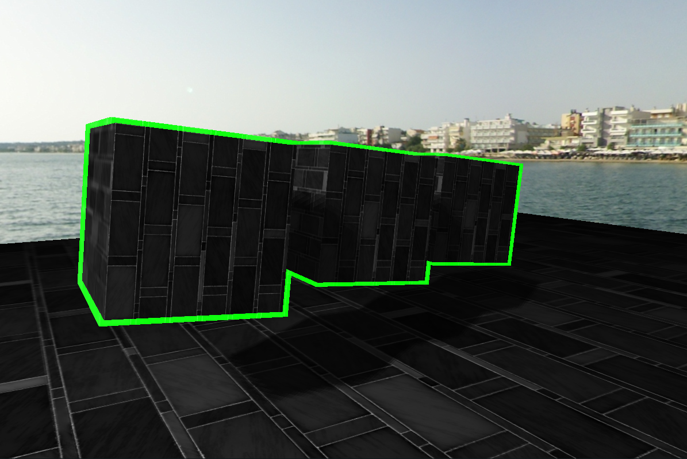

### In this OpenGL project you can see:

1. Per-pixel Lightning (a shader)
2. Normal Mapping
3. Parallax Mapping (on the floor) — pressing the P key
4. Stensil Testing (borders of the cubes)
5. Shadow Mapping
6. After Effect (green lens effect) — pressing the G key
7. Translucent billboards that require orderly display
8. Cubemaps (one mirror cube)
9. Skybox

### The results of the program can be seen on the screenshots in the folder Images or below

